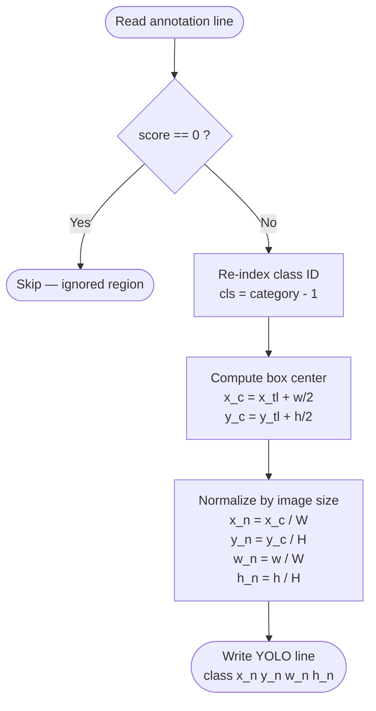
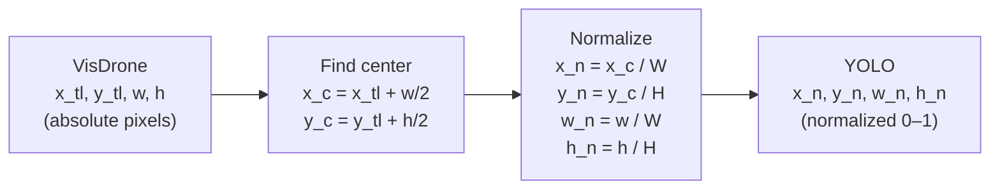
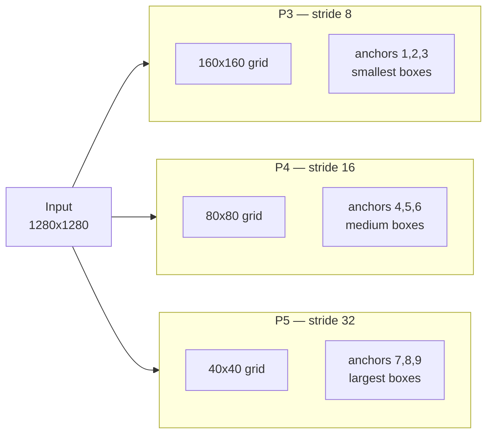
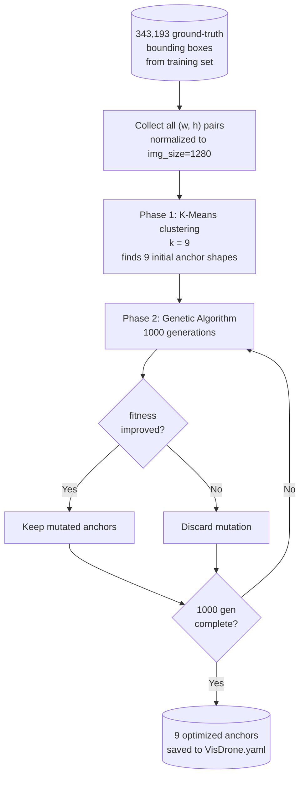
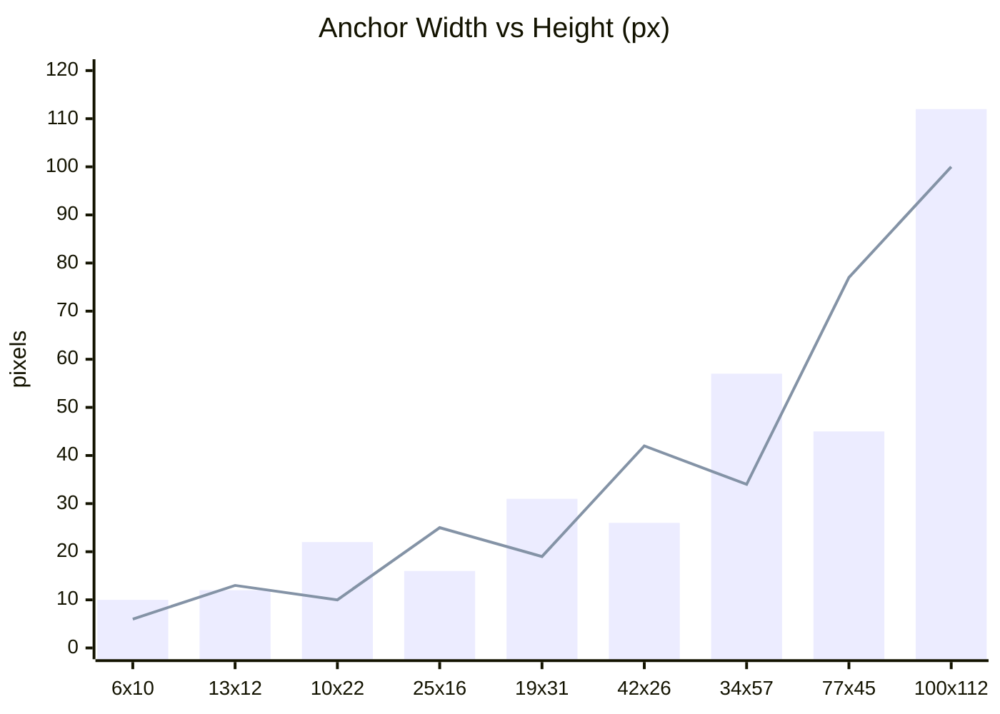
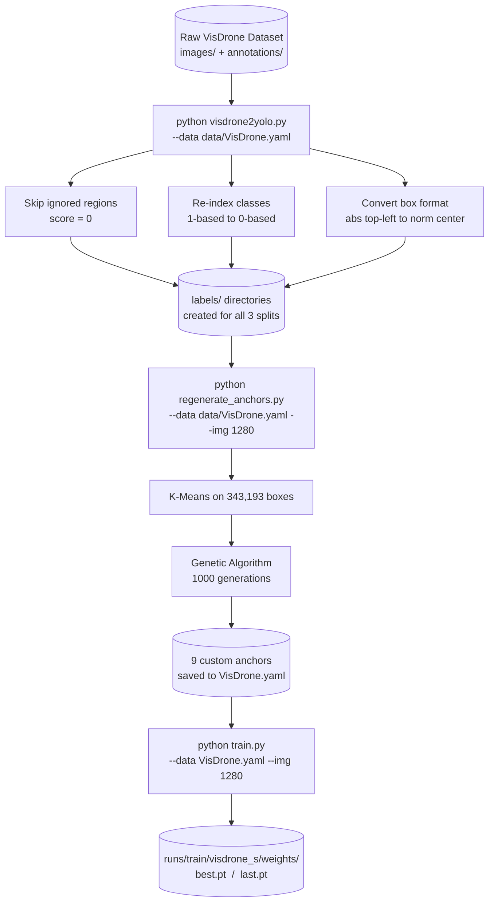

# Training YOLOv5 on the VisDrone Dataset

> **Note on diagrams:** diagrams in this file use [Mermaid](https://mermaid.js.org/).
> In VS Code install the **Markdown Preview Mermaid Support** extension to render them.
> On GitHub they render automatically.

## Table of Contents
1. [Dataset Overview](#1-dataset-overview)
2. [Why Convert Annotations?](#2-why-convert-annotations)
3. [VisDrone → YOLO Conversion](#3-visdrone--yolo-conversion)
4. [Why Regenerate Anchors?](#4-why-regenerate-anchors)
5. [Anchor Generation Results](#5-anchor-generation-results)
6. [Training](#6-training)

---

## 1. Dataset Overview

VisDrone is an aerial drone dataset captured from varying altitudes and angles.
It contains 10 object classes:

| ID | Class           |
|----|-----------------|
| 0  | pedestrian      |
| 1  | people          |
| 2  | bicycle         |
| 3  | car             |
| 4  | van             |
| 5  | truck           |
| 6  | tricycle        |
| 7  | awning-tricycle |
| 8  | bus             |
| 9  | motor           |

The dataset is split into three sets:

```
datasets/VisDrone/
├── VisDrone2019-DET-train/       (6471 images)
├── VisDrone2019-DET-val/         ( 548 images)
└── VisDrone2019-DET-test-dev/    (1610 images)
```

Each split has this internal structure:

```
VisDrone2019-DET-train/
├── images/
│   ├── 0000001_00000_d_0000001.jpg
│   └── ...
└── annotations/
    ├── 0000001_00000_d_0000001.txt
    └── ...
```

---

## 2. Why Convert Annotations?

VisDrone and YOLO use completely different annotation formats.
You cannot train YOLOv5 directly on raw VisDrone annotations.

### VisDrone Format

Each annotation file has one line per object with **8 comma-separated fields**:

```
bbox_left, bbox_top, bbox_width, bbox_height, score, category, truncation, occlusion
```

Coordinates are **absolute pixel values** anchored at the **top-left corner** of the box.

### YOLO Format

Each label file has one line per object with **5 space-separated fields**:

```
class_id  x_center  y_center  width  height
```

All coordinates are **normalized to [0.0, 1.0]** relative to the image dimensions,
and the box is described by its **center point** — not its top-left corner.

### Format Comparison

| Property          | VisDrone                     | YOLO                    |
|-------------------|------------------------------|-------------------------|
| Coordinate origin | Top-left corner              | Top-left corner         |
| Values            | Absolute pixels              | Normalized 0.0 – 1.0   |
| Box reference     | Top-left corner + size       | Center point + size     |
| Class indexing    | 1-indexed  (1 – 10)          | 0-indexed  (0 – 9)      |
| Ignored regions   | Marked with score = 0        | Not present             |
| Fields per object | 8                            | 5                       |

**Example mapping:**

| VisDrone line             | YOLO output                       | Note                  |
|---------------------------|-----------------------------------|-----------------------|
| `684,8,273,116,0,0,0,0`  | *(skipped)*                       | score=0, ignored      |
| `708,471,74,33,1,4,0,1`  | `3 0.6898 0.6771 0.0685 0.0458`  | class 4 → id 3        |

---

## 3. VisDrone → YOLO Conversion

The conversion is handled by `visdrone2yolo.py`.



### Step 1 — Skip Ignored Regions

VisDrone uses `score = 0` (field index 4) to mark **ignored regions** —
areas too crowded or ambiguous to annotate reliably.

```python
if row[4] == '0':   # score = 0 → ignored region
    continue
```

### Step 2 — Re-index the Class ID

VisDrone categories are **1-indexed**. YOLO requires **0-indexed** classes:

```python
cls = int(row[5]) - 1
```

| VisDrone category | YOLO class_id | Name        |
|-------------------|---------------|-------------|
| 1                 | 0             | pedestrian  |
| 2                 | 1             | people      |
| 3                 | 2             | bicycle     |
| 4                 | 3             | car         |
| ...               | ...           | ...         |
| 10                | 9             | motor       |

### Step 3 — Convert Bounding Box Coordinates



**Worked example** — image 1080×720, box `(708, 471, 74, 33)`:

| Step         | Calculation               | Result   |
|--------------|---------------------------|----------|
| x center     | 708 + 74/2 = 745          | —        |
| y center     | 471 + 33/2 = 487.5        | —        |
| x normalized | 745 / 1080                | 0.6898   |
| y normalized | 487.5 / 720               | 0.6771   |
| w normalized | 74 / 1080                 | 0.0685   |
| h normalized | 33 / 720                  | 0.0458   |

YOLO output line: `3 0.6898 0.6771 0.0685 0.0458`

### Step 4 — Write Label Files

After conversion a `labels/` directory is created, mirroring `images/`.
YOLOv5 finds labels by replacing `/images/` with `/labels/` in each image path.

**Before conversion:**

```
VisDrone2019-DET-train/
├── images/
│   ├── frame_001.jpg
│   └── frame_002.jpg
└── annotations/
    ├── frame_001.txt
    └── frame_002.txt
```

**After conversion:**

```
VisDrone2019-DET-train/
├── images/
│   ├── frame_001.jpg
│   └── frame_002.jpg
├── annotations/
│   ├── frame_001.txt    (untouched)
│   └── frame_002.txt    (untouched)
└── labels/              <-- created by visdrone2yolo.py
    ├── frame_001.txt    (YOLO format)
    └── frame_002.txt    (YOLO format)
```

### Run the Conversion

```bash
python visdrone2yolo.py --data data/VisDrone.yaml
```

---

## 4. Why Regenerate Anchors?

### What Are Anchors?

YOLOv5 is an **anchor-based** detector. Instead of predicting boxes from scratch,
the network predicts small **offsets** from a set of pre-defined reference shapes
called anchors. This makes training faster and more stable.

YOLOv5 uses **3 detection heads** at different spatial scales,
each responsible for a different object size range:



For each cell in a feature map grid, the network predicts offsets
`(dx, dy, dw, dh)` from each of the 3 anchors assigned to that head.
The anchor closest in shape to the real object needs the smallest correction
— so **anchor quality directly affects accuracy**.

### Why Default Anchors Fail on VisDrone

The default anchors were tuned for **COCO** — a ground-level dataset
where objects are large and close to the camera.

VisDrone is captured from a **drone looking down**. Objects are:
- Much smaller relative to the frame
- Denser (many objects per image)
- Mostly tall in aspect ratio (people viewed from above)

| Head | Default COCO anchors (px)        | Custom VisDrone anchors (px) |
|------|----------------------------------|------------------------------|
| P3   | 10×13, 16×30, 33×23             | 6×10, 13×12, 10×22           |
| P4   | 30×61, 62×45, 59×119            | 25×16, 19×31, 42×26          |
| P5   | 116×90, 156×198, 373×326        | 34×57, 77×45, 100×112        |

The largest COCO anchor is **373×326 px**.
The largest VisDrone anchor is only **100×112 px** —
confirming that even the biggest objects in VisDrone
are tiny compared to COCO.

Training with mismatched anchors forces the network to learn
large corrections, which slows convergence and hurts recall on small objects.

### How Anchor Generation Works



The **fitness function** scores how well a set of anchors covers the dataset:

```
fitness = mean( best_ratio × (best_ratio > threshold) )

where:
  best_ratio = for each ground-truth box, the IoU-like ratio
               with its closest anchor
  threshold  = 1 / anchor_t  (default anchor_t = 4.0)
```

A high fitness means most ground-truth boxes have an anchor
that closely matches their shape — so the network has less to correct.

---

## 5. Anchor Generation Results

### Final Anchors for VisDrone at 1280px

| Head       | # | W × H     | Area (px²) | Aspect |
|------------|---|-----------|------------|--------|
| P3 (small) | 1 | 6 × 10    | 60         | tall   |
| P3 (small) | 2 | 13 × 12   | 156        | square |
| P3 (small) | 3 | 10 × 22   | 220        | tall   |
| P4 (med)   | 4 | 25 × 16   | 400        | wide   |
| P4 (med)   | 5 | 19 × 31   | 589        | tall   |
| P4 (med)   | 6 | 42 × 26   | 1092       | wide   |
| P5 (large) | 7 | 34 × 57   | 1938       | tall   |
| P5 (large) | 8 | 77 × 45   | 3465       | wide   |
| P5 (large) | 9 | 100 × 112 | 11200      | square |

### Anchor Size Distribution



### Key Observations

**Smallest anchor: 6×10 px**
The network is tuned to detect objects as small as 6 pixels wide —
essential for distant pedestrians in drone footage.

**Largest anchor: 100×112 px**
Covers buses and trucks from low altitude.
Far smaller than COCO's 373×326, confirming VisDrone objects are
systematically tiny.

**Many tall anchors — 10×22, 19×31, 34×57:**
Pedestrians viewed from above appear taller than wide due to the
downward camera angle. The algorithm discovered this bias automatically
from the data distribution.

**BPR = 0.9995:**
99.95% of all ground-truth boxes are well-covered by at least one
anchor — near-perfect recall ceiling before training even begins.

---

## 6. Training

With labels converted and anchors saved to `data/VisDrone.yaml`, start training:

```bash
python train.py \
  --data data/VisDrone.yaml \
  --weights yolov5s.pt \
  --img 1280 \
  --batch 8 \
  --epochs 100 \
  --hyp data/hyps/hyp.scratch-low.yaml \
  --name visdrone_s
```

### Recommended Hyperparameter Adjustments

| Parameter  | Default | Recommended | Reason                                           |
|------------|---------|-------------|--------------------------------------------------|
| `anchor_t` | 4.0     | 5.0         | Looser matching threshold — catches more small objects |
| `hsv_s`    | 0.7     | 0.7         | Keep — drone lighting varies with weather        |
| `hsv_v`    | 0.4     | 0.4         | Keep — brightness variation is realistic         |
| `mosaic`   | 1.0     | 1.0         | Keep — creates artificially dense scenes         |

### Full Pipeline


